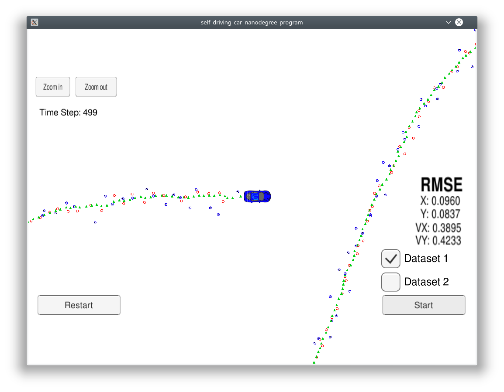
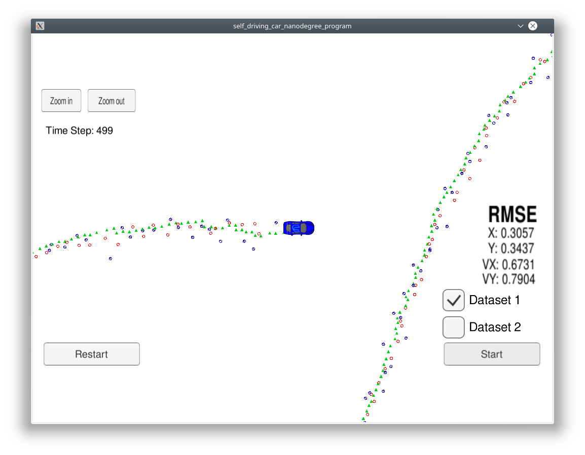

# Extended Kalman Filter Project

# Summary

This project implements sensorfusion of radar and lidar sensor using an extened kalman filter.

The steps of this project are the following:

* Implement the extended kalman filter
* Connect the kalman filter with the simulator using websockets
* Run the simulator and process the sensor data sent over the websockets
* Track the object with position and velocity
* Compare the result with the ground truth as RSME
* Check the results with only one of the sensors used

# The filter

## System
The system model uses position and velocity and assumes a constant veloctiy vector.

## Radar sensor

## Lidar sensor

# Results

## Expectations
Radar and lidar sensors complement each other with their different characteristics.

The position obtained by radar sensors have a lower spatial resolution but can also detect the speed ob an object. With lidar sensors the spatial resolution is higher but the objects speed can't be measured directly.

Since this implementation models the object with a constant velocity vector the result on the object here which moves on a circular trajectory are not the best. In the next project a better system model which is based on a constant steering angle in combination with an unscented kalman filter will be used.

## Result

As expected the result with both sensors are the best:

With radar only the position is not very exact:

With lidar only the velocity is not very exact:

# Build

## Dependencies

* uWebSocketIO
* cmake >= 3.5
  * All OSes: [click here for installation instructions](https://cmake.org/install/)
* make >= 4.1 (Linux, Mac), 3.81 (Windows)
  * Linux: make is installed by default on most Linux distros
  * Mac: [install Xcode command line tools to get make](https://developer.apple.com/xcode/features/)
  * Windows: [Click here for installation instructions](http://gnuwin32.sourceforge.net/packages/make.htm)
* gcc/g++ >= 5.4
  * Linux: gcc / g++ is installed by default on most Linux distros
  * Mac: same deal as make - [install Xcode command line tools](https://developer.apple.com/xcode/features/)
  * Windows: recommend using [MinGW](http://www.mingw.org/)

## Basic Build Instructions

1. Clone this repo.
2. Make a build directory: `mkdir build && cd build`
3. Compile: `cmake .. && make` 
   * On windows, you may need to run: `cmake .. -G "Unix Makefiles" && make`
4. Run it: `./ExtendedKF `
